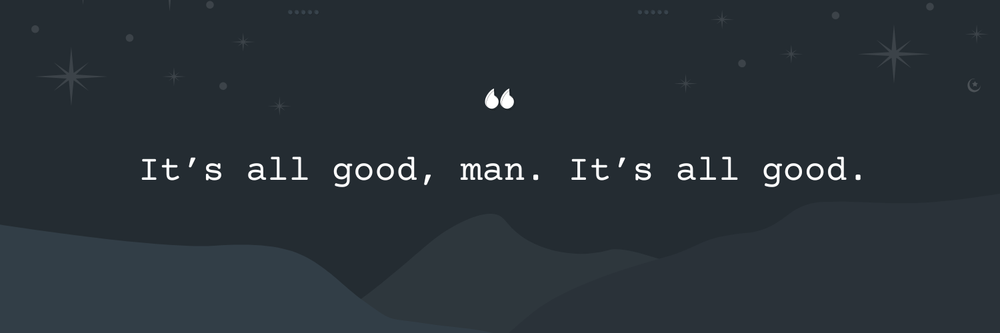

# 📌 Hello there! My name is Amirbek!
### I'm a Developer, Aspiring IT Specialist and Technology Enthusiast. Currently a high school student with a focus on programming, software development and AI. Passionate about creating software that improves lives and exploring the intersection of technology and humanity. Additionally, I really like Netflix Series and tv-shows like breaking bad and its spin-off Better Call Saul! 

## 🌐 Socials

## 🔗[amirby.com](https://amirby.com)

# 💻 Tech Stack
           

# 📊 GitHub Stats
<picture>
  <source
    srcset="https://github-readme-stats.vercel.app/api/top-langs/?username=amirnootfound&layout=compact&show_icons=true&theme=dark"
    media="(prefers-color-scheme: dark)"
  />
  <source 
    srcset="https://github-readme-stats.vercel.app/api?username=amirnootfound&show_icons=true"
    media="(prefers-color-scheme: light), (prefers-color-scheme: no-preference)"
  />
  
</picture>   

<picture>
  <source
    srcset="https://github-readme-stats.vercel.app/api?username=amirnootfound&show_icons=true&theme=dark"
    media="(prefers-color-scheme: dark)"
  />
  <source
    srcset="https://github-readme-stats.vercel.app/api?username=amirnootfound&show_icons=true"
    media="(prefers-color-scheme: light), (prefers-color-scheme: no-preference)"
  />
  
</picture> 

<picture>
  <source media="(prefers-color-scheme: dark)" srcset="https://raw.githubusercontent.com/amirnootfound/amirnootfound/output/github-snake-dark.svg" />
  <source media="(prefers-color-scheme: light)" srcset="https://raw.githubusercontent.com/amirnootfound/amirnootfound/output/github-snake.svg" />
  
</picture>

---

